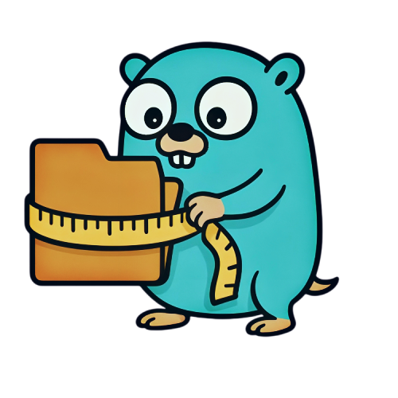

<div align="center">
  
  <h1>DeezBytes</h1>
  <p><em>Directory Size Exporter for Prometheus</em></p>
</div>


**DeezBytes** is a lightweight Prometheus exporter that keeps an eye on the size of your directories. You get live metrics about how much disk space your important folders are eating up — perfect for monitoring and alerting.

[](https://github.com/AlexisHutin/DeezBytes/actions/workflows/ci-cd.yml)

---

## What’s the deal?

- Watch multiple directories, configured via a simple YAML file
- Get size metrics labeled by directory name, straight into Prometheus

---

## Getting started

### Configuration

Create your config file (`config.yml`) with the directories you want to watch. For example:

```yaml
directories:
  - path: "/var/log"
    label: "var_log"
  - path: "/home/alex/data"
    label: "alex_data"
```

Nothing fancy — just tell DeezBytes where to look and what to call it.

---

### Build it

Grab the source and build:

```bash
go build -o deezbytes main.go
```

---

### Run it

Start the exporter with defaults:

```bash
./deezbytes
```

Defaults:  
- Config: `./config.yml`  
- Port: `9101`  
- Collection timeout: `15s`

You can override these with environment variables or flags (see below).

---

## Docker

You can run DeezBytes using Docker:

### Run with Docker 🐳

Here’s an example of a docker run:

```bash
docker run -d \
  --name deezbytes \
  -v $(pwd)/config.yml:/config.yml \
  -v /var/log:/data/var_log:ro \
  -v /home/user/documents:/data/docs:ro \
  -e CONFIG_PATH=/config.yml \
  -p 9101:9101 \
  ghcr.io/alexishutin/deezbytes:latest \
  --disable-exporter-metrics \
  --collection-timeout=10s
```

### Run with Docker Compose 🐳

Here’s an example `docker-compose.yml` to get you going:

```yaml
version: '3.8'
services:
  deezbytes:
    image: ghcr.io/alexishutin/deezbytes:latest
    container_name: deezbytes
    ports:
      - "9101:9101"
    volumes:
      - ./config.yml:/config.yml:ro
      - /var/log:/data/var_log:ro
      - /home/user/documents:/data/docs:ro
    environment:
      - CONFIG_PATH=/config.yml
    command: >
      --collection-timeout=10s
      --disable-exporter-metrics
```

---

### Environment variables & flags

| Name / Flag                | What it does                                     | Default         |
|---------------------------|-------------------------------------------------|-----------------|
| `CONFIG_PATH`              | Path to your config YAML file                    | `./config.yml`  |
| `EXPORTER_PORT`            | Port for the HTTP metrics endpoint               | `9101`          |
| `--disable-exporter-metrics` | Disable built-in Go and process metrics          | `false`         |
| `--collection-timeout`      | Max time to spend collecting directory sizes     | `15s`           |


---

### What metrics?

- `directory_size_bytes{name="<label>"}` — size of each monitored directory in bytes

Plus the usual Go runtime and process metrics, unless you disable them.

---

### Hook it up to Prometheus

Add this job in your Prometheus config:

```yaml
scrape_configs:
  - job_name: "deezbytes"
    static_configs:
      - targets: ["localhost:9101"]
```

Then you’re good to go.

---

## TODO

- [x] **Dockerfile:** create an official Docker image for easy deployment  
- [x] **Docker Compose:** example setup for quick testing with Prometheus + DeezBytes  
- [x] **CI/CD:** add GitHub Actions or other pipeline for automated build & test  
- [ ] **Grafana example:** dashboard config to visualize directory size trends 
- [ ] **Documentation:** a better doc to explain things 

---

## 🙌 Contributing

Found a bug? Got a cool idea? Fork the repo and open a pull request.

---

## 🪪 License

MIT. Do what you want, just don’t sue anyone.
